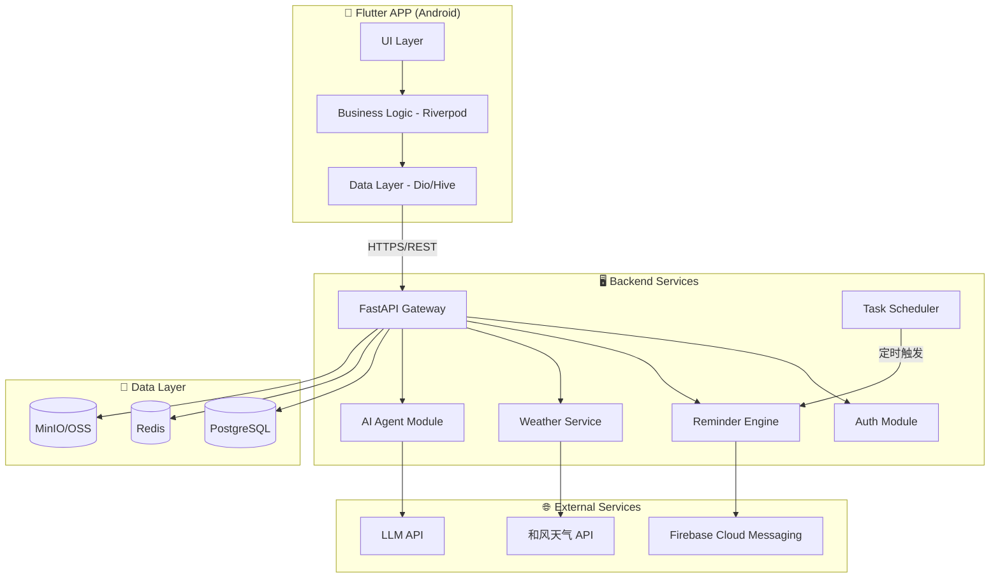
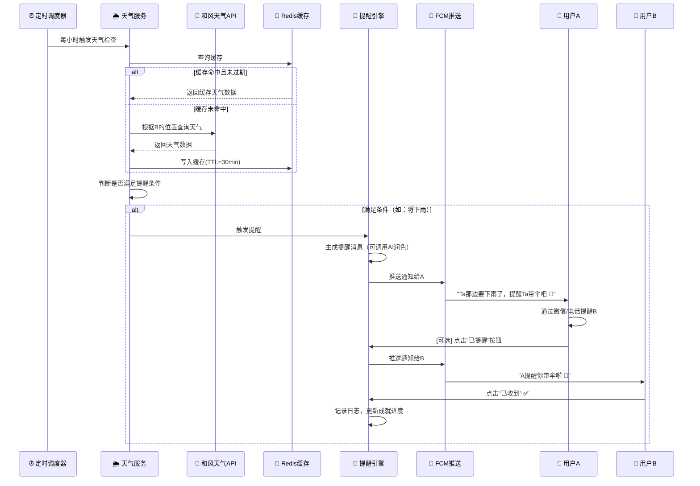
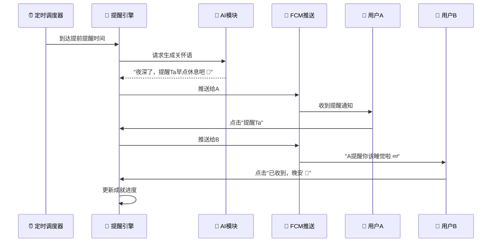
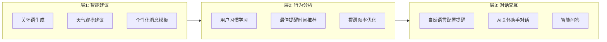

# Ta的世界（TaWorld）— 技术架构方案

> **版本:** v1.0 | **日期:** 2026-05-09 | **状态:** 待确认

---

## 一、项目定位

一款以「关怀」为核心的情感连接APP。用户通过建立一对一关系，在天气变化、作息时间等场景下，**由APP提醒用户A去主动关心用户B**，保留人与人之间的温度。

### 核心设计原则

| 原则 | 说明 |
|------|------|
| 🫶 人是桥梁 | APP不直接提醒B，而是提醒A去关心B |
| 🔒 隐私优先 | 不暴露对方位置，仅用于天气查询 |
| 🎯 简洁温暖 | 交互极简，体验温暖 |
| 📈 可扩展 | 模块化设计，支持自定义提醒和AI扩展 |

---

## 二、技术栈选型

### 2.1 前端（移动端）

| 层面 | 选型 | 理由 |
|------|------|------|
| **框架** | Flutter 3.x + Dart | 单代码库跨平台（先Android后iOS）；UI表现力强；AI代码生成友好 |
| **状态管理** | Riverpod | 类型安全、可测试、Flutter官方推荐的下一代方案 |
| **路由** | GoRouter | 声明式路由，深度链接支持 |
| **网络请求** | Dio | 拦截器、缓存、重试机制完善 |
| **本地存储** | Hive + SharedPreferences | Hive用于结构化数据缓存，SP用于轻量配置 |
| **推送** | Firebase Cloud Messaging (FCM) | Android推送标准方案 |
| **定位** | Geolocator | 跨平台GPS定位 |
| **UI组件** | Material 3 + 自定义主题 | Material Design 3 温暖风格定制 |

### 2.2 后端

| 层面 | 选型 | 理由 |
|------|------|------|
| **语言/框架** | Python 3.12 + FastAPI | 异步高性能；AI生态原生支持；开发效率高 |
| **ORM** | SQLAlchemy 2.0 + Alembic | 成熟稳定，Alembic管理数据库迁移 |
| **任务调度** | APScheduler + Celery | APScheduler处理定时提醒；Celery处理异步重任务 |
| **认证** | JWT (access + refresh token) | 无状态认证，移动端友好 |
| **API文档** | FastAPI内置Swagger/ReDoc | 自动生成，开发调试方便 |

### 2.3 数据与基础设施

| 层面 | 选型 | 理由 |
|------|------|------|
| **主数据库** | PostgreSQL 16 | 关系型数据，JSONB支持灵活配置存储 |
| **缓存/队列** | Redis 7 | 缓存天气数据、会话管理、Celery消息队列 |
| **对象存储** | MinIO（自部署）/ 阿里云OSS | 头像等文件存储 |
| **天气API** | 和风天气 (QWeather) | 中国区域覆盖好，免费额度够用 |
| **AI服务** | OpenAI API / 通义千问 | 智能建议、行为分析、对话交互 |
| **部署** | Docker + Docker Compose | 单机部署，一键启动全部服务 |
| **监控** | Prometheus + Grafana（后期） | 后期加入，初期可用日志 |

---

## 三、系统架构

### 3.1 整体架构图



### 3.2 架构模式

采用 **模块化单体（Modular Monolith）** 架构：

- 初期所有模块在一个FastAPI应用内，通过清晰的模块边界分离
- 每个模块有独立的 routes / services / models
- 未来可按需拆分为微服务

---

## 四、项目目录结构

```
TaWorld/
├── app/                          # Flutter 移动端
│   ├── lib/
│   │   ├── main.dart
│   │   ├── app/                  # App入口、路由、主题配置
│   │   │   ├── router.dart
│   │   │   ├── theme.dart
│   │   │   └── app.dart
│   │   ├── core/                 # 核心工具层
│   │   │   ├── constants/
│   │   │   ├── utils/
│   │   │   ├── network/          # Dio配置、拦截器
│   │   │   └── extensions/
│   │   ├── data/                 # 数据层
│   │   │   ├── models/           # 数据模型 (JSON序列化)
│   │   │   ├── repositories/     # 数据仓库实现
│   │   │   └── datasources/      # API / 本地数据源
│   │   ├── domain/               # 业务逻辑层
│   │   │   ├── entities/
│   │   │   ├── repositories/     # 仓库接口
│   │   │   └── usecases/
│   │   ├── presentation/         # UI层
│   │   │   ├── screens/          # 页面
│   │   │   ├── widgets/          # 公共组件
│   │   │   └── providers/        # Riverpod Providers
│   │   └── services/             # 平台服务
│   │       ├── location_service.dart
│   │       ├── notification_service.dart
│   │       └── ai_service.dart
│   ├── android/
│   ├── ios/
│   ├── test/
│   └── pubspec.yaml
│
├── server/                       # Python 后端
│   ├── app/
│   │   ├── main.py               # FastAPI入口
│   │   ├── core/                 # 核心配置
│   │   │   ├── config.py         # 环境变量/配置
│   │   │   ├── security.py       # JWT/密码加密
│   │   │   ├── database.py       # DB连接
│   │   │   └── dependencies.py   # FastAPI依赖注入
│   │   ├── modules/              # 业务模块（模块化单体）
│   │   │   ├── auth/             # 认证模块
│   │   │   │   ├── router.py
│   │   │   │   ├── service.py
│   │   │   │   ├── schemas.py
│   │   │   │   └── models.py
│   │   │   ├── users/            # 用户模块
│   │   │   ├── relationships/    # 关系模块
│   │   │   ├── reminders/        # 提醒模块
│   │   │   ├── achievements/     # 成就模块
│   │   │   ├── weather/          # 天气模块
│   │   │   └── ai/               # AI Agent模块
│   │   ├── tasks/                # 定时任务
│   │   │   ├── scheduler.py
│   │   │   ├── weather_check.py
│   │   │   └── reminder_trigger.py
│   │   └── common/               # 公共工具
│   │       ├── exceptions.py
│   │       ├── pagination.py
│   │       └── response.py
│   ├── alembic/                  # 数据库迁移
│   ├── tests/
│   ├── requirements.txt
│   ├── Dockerfile
│   └── .env.example
│
├── docker-compose.yml            # 一键部署
├── docs/                         # 项目文档
│   ├── api.md
│   ├── database.md
│   └── deployment.md
├── .gitignore
└── README.md
```

---

## 五、数据库设计

### 5.1 ER关系图

```mermaid
erDiagram
    users ||--o{ relationships : "参与"
    users ||--o{ user_locations : "拥有"
    users ||--o{ user_achievements : "解锁"
    users ||--o{ devices : "注册"
    relationships ||--o{ reminder_configs : "配置"
    reminder_configs ||--o{ reminder_logs : "产生"
    achievements ||--o{ user_achievements : "被解锁"

    users {
        uuid id PK
        string phone UK
        string nickname
        string avatar_url
        string password_hash
        timestamp created_at
        timestamp updated_at
    }

    relationships {
        uuid id PK
        uuid user_a_id FK
        uuid user_b_id FK
        enum type "couple|family|friend"
        enum status "pending|active|dissolved"
        string invite_code UK
        string nickname_a_for_b
        string nickname_b_for_a
        timestamp created_at
    }

    reminder_configs {
        uuid id PK
        uuid relationship_id FK
        enum category "weather|sleep|meal|custom"
        boolean enabled
        jsonb config "灵活配置项"
        uuid created_by FK
        timestamp created_at
        timestamp updated_at
    }

    reminder_logs {
        uuid id PK
        uuid config_id FK
        uuid sender_id FK
        uuid receiver_id FK
        string message
        enum status "triggered|sent|confirmed"
        timestamp triggered_at
        timestamp sent_at
        timestamp confirmed_at
    }

    user_locations {
        uuid user_id PK_FK
        float latitude
        float longitude
        string city
        string district
        timestamp updated_at
    }

    achievements {
        uuid id PK
        string name
        string description
        string icon
        string category
        jsonb unlock_condition
        int points
    }

    user_achievements {
        uuid id PK
        uuid user_id FK
        uuid achievement_id FK
        int progress
        boolean unlocked
        timestamp unlocked_at
    }

    devices {
        uuid id PK
        uuid user_id FK
        string fcm_token
        string device_info
        timestamp created_at
    }
```

### 5.2 关键字段说明

**reminder_configs.config (JSONB)** — 用灵活的JSON存储不同类型提醒的配置：

```json
// 天气提醒配置示例
{
  "notify_conditions": ["rain", "snow", "extreme_cold", "extreme_heat"],
  "custom_messages": {
    "rain": "外面要下雨了，提醒Ta带伞 🌂",
    "snow": "要下雪啦，提醒Ta注意保暖 ❄️"
  },
  "check_interval_minutes": 60
}

// 睡觉提醒配置示例
{
  "user_a_sleep_time": "23:00",
  "user_b_sleep_time": "22:30",
  "advance_minutes": 30
}

// 吃饭提醒配置示例
{
  "meals": [
    {"name": "午餐", "user_a_time": "12:00", "user_b_time": "12:30", "advance_minutes": 15},
    {"name": "晚餐", "user_a_time": "18:30", "user_b_time": "19:00", "advance_minutes": 15}
  ]
}
```

---

## 六、核心业务流程

### 6.1 天气提醒流程（核心功能）



### 6.2 定时提醒流程（睡觉/吃饭）



---

## 七、API设计概览

### 基础路径: `/api/v1`

| 模块 | 方法 | 路径 | 说明 |
|------|------|------|------|
| **认证** | POST | `/auth/register` | 手机号注册 |
| | POST | `/auth/login` | 登录获取Token |
| | POST | `/auth/refresh` | 刷新Token |
| **用户** | GET | `/users/me` | 获取当前用户信息 |
| | PUT | `/users/me` | 更新用户信息 |
| | PUT | `/users/me/location` | 上报位置 |
| **关系** | POST | `/relationships/invite` | 生成邀请码 |
| | POST | `/relationships/join` | 通过邀请码加入 |
| | GET | `/relationships` | 获取我的所有关系 |
| | GET | `/relationships/{id}` | 获取关系详情 |
| | PUT | `/relationships/{id}` | 更新关系（昵称等） |
| | DELETE | `/relationships/{id}` | 解除关系 |
| **提醒** | GET | `/relationships/{id}/reminders` | 获取关系的提醒配置 |
| | POST | `/relationships/{id}/reminders` | 创建提醒配置 |
| | PUT | `/reminders/{id}` | 更新提醒配置 |
| | DELETE | `/reminders/{id}` | 删除提醒配置 |
| | POST | `/reminders/{id}/send` | 一键提醒（A→B） |
| | POST | `/reminders/{id}/confirm` | 确认收到（B确认） |
| **日志** | GET | `/reminders/{id}/logs` | 提醒历史记录 |
| **成就** | GET | `/achievements` | 所有成就列表 |
| | GET | `/users/me/achievements` | 我的成就 |
| **AI** | POST | `/ai/suggest` | AI生成关怀建议 |
| | POST | `/ai/chat` | AI对话交互 |
| **天气** | GET | `/weather/current` | 查询天气（内部调试用） |

---

## 八、AI Agent 设计

### 8.1 三层AI能力



| 层级 | 功能 | 实现方式 | 优先级 |
|------|------|---------|--------|
| **层1** | 智能建议 | LLM API + Prompt模板 | 🔴 P0 首期 |
| **层2** | 行为分析 | 日志统计 + LLM分析 | 🟡 P1 二期 |
| **层3** | 对话交互 | LangChain Agent + 工具调用 | 🟢 P2 三期 |

---

## 九、成就系统设计

### 预设成就示例

| 成就名称 | 解锁条件 | 积分 |
|----------|---------|------|
| 🌂 初次守护 | 首次成功完成天气提醒闭环 | 10 |
| 🔥 连续守护7天 | 连续7天完成至少1次提醒 | 50 |
| 🌙 晚安大使 | 累计完成30次睡觉提醒 | 100 |
| 🍚 干饭督导 | 累计完成30次吃饭提醒 | 100 |
| 💯 百日陪伴 | 关系建立满100天且活跃 | 200 |
| 🎨 创意达人 | 创建5个自定义提醒 | 50 |
| ❤️ 双向奔赴 | A和B互相完成提醒各10次 | 150 |

---

## 十、部署方案

### 10.1 初期部署（Docker Compose 单机）

```yaml
# docker-compose.yml 核心结构
services:
  api:          # FastAPI 后端
  postgres:     # PostgreSQL 数据库
  redis:        # Redis 缓存/队列
  celery:       # Celery Worker
  scheduler:    # APScheduler 定时任务
  minio:        # 对象存储（可选）
```

### 10.2 部署要求

| 资源 | 最低配置 | 推荐配置 |
|------|---------|---------|
| CPU | 2核 | 4核 |
| 内存 | 4GB | 8GB |
| 存储 | 40GB SSD | 100GB SSD |
| 带宽 | 5Mbps | 10Mbps |

---

## 十一、开发阶段规划

### Phase 1 — MVP（4-6周）
- [x] 项目架构搭建
- [ ] 用户注册/登录
- [ ] 关系建立（邀请码机制）
- [ ] 天气提醒（核心功能）
- [ ] 一键提醒 + 确认机制
- [ ] FCM推送集成
- [ ] 基础UI

### Phase 2 — 完善（3-4周）
- [ ] 睡觉/吃饭提醒
- [ ] 成就系统
- [ ] AI智能建议（层1）
- [ ] 提醒历史/统计
- [ ] UI打磨

### Phase 3 — 增强（3-4周）
- [ ] 自定义提醒
- [ ] AI行为分析（层2）
- [ ] AI对话交互（层3）
- [ ] 用户反馈机制
- [ ] 性能优化

### Phase 4 — 扩展（待定）
- [ ] iOS版本
- [ ] 商业化模块
- [ ] 应用商店上架
- [ ] 更多社交功能

---

## 十二、给AI开发者的指引

> 本项目将由多个AI模型协作开发。以下是确保代码一致性的关键约定：

### 代码规范
- **Python**: 遵循PEP 8，使用type hints，所有函数写docstring
- **Dart/Flutter**: 遵循Effective Dart，使用lint规则
- **命名**: snake_case (Python), camelCase (Dart), UPPER_SNAKE (常量)
- **注释**: 中文注释，英文代码

### Git规范
- **分支**: `main` / `develop` / `feature/xxx` / `bugfix/xxx`
- **Commit**: `feat:` / `fix:` / `docs:` / `refactor:` / `chore:`

### API规范
- RESTful风格
- 统一响应格式: `{"code": 0, "message": "success", "data": {}}`
- 错误码体系: 1xxx认证, 2xxx用户, 3xxx关系, 4xxx提醒, 5xxx系统

---

> [!IMPORTANT]
> 此文档为架构方案初版，请确认后再进入开发阶段。如有任何调整需求请随时提出。
